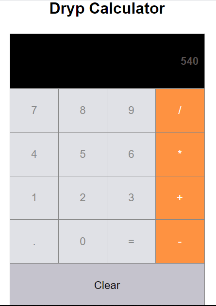

# DRYP Calculator

#### 1. I have used function as well as class components in this react-app
#### 2. I haveUsed Mathjs library from [mathjs.org](https://mathjs.org/) for performing various math calculations.

